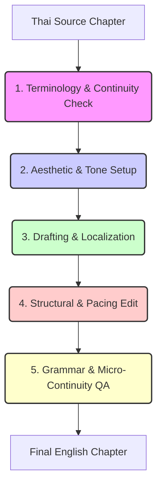

# 🌐 Primordium Saga: English Localization Space

Welcome to the official localization space for the **Primordium Saga**. This directory is structured to house the native literary English translation while maintaining the psychological horror, digital decay, and existential themes of the original Thai manuscript.

---

## 📂 Directory Layout

- **`system_documents/`**: Core localization assets and design references.
  - [README.md](file:///Users/ntwkkm/primordium_city/english_localization/README.md) - This document.
  - [terminology_lexicon.md](file:///Users/ntwkkm/primordium_city/english_localization/system_documents/terminology_lexicon.md) - Official translation glossary mapping Thai concepts to native English terminology.
  - [world_bible_en.md](file:///Users/ntwkkm/primordium_city/english_localization/system_documents/world_bible_en.md) - Complete English translation of `WORLD_BIBLE.md`.
- **`arc_1_the_fracture/`**: Chapters 1–20 (Resolution: `Pristine` $\rightarrow$ `Bit Rot`).
- **`arc_2_the_covenant/`**: Chapters 21–40 (Resolution: `Bit Rot` $\rightarrow$ `Loss`).
- **`arc_3_the_sump/`**: Chapters 41–60 (Resolution: `Loss` $\rightarrow$ `Sepsis`).
- **`arc_4_the_dissolution/`**: Chapters 61–80 (Resolution: `Sepsis` $\rightarrow$ `Meltdown`).
- **`arc_5_the_evolution/`**: Chapters 81–108 (Resolution: `Post-Sepsis` $\rightarrow$ `Zero-Bit`).
- **`epilogue/`**: Epilogue Chapters 101–108 (Resolution: `Bit Rot` $\rightarrow$ `Null`).

---

## ⚙️ The Multi-Agent Localization Pipeline

All chapter translations undergo a strict sequential quality control process before final publication:

1. **Terminology Audit (`architect_soul`):** Verifies all universe mechanics, rules, and terms are aligned with the `terminology_lexicon.md`.
2. **Aesthetic Direction (`art_soul`):** Specifies the visual, auditory, and symbolic landscape for the chapter (e.g., how the light and glitches should be described).
3. **Translation & Native Adaptation (`localization_weaver` + `scribe_soul`):** Performs the core translation, replacing literal phrasing with evocative speculative-fiction English idioms.
4. **Narrative Pacing & P.O.V. Control (`editor_soul`):** Reviews the story flow, tension, and character voice alignment.
5. **Final Polish & Grammar (`qa_soul`):** Checks syntax, catches typos, and audits micro-continuity (ensuring character wounds or mechanical decays are consistently represented).
